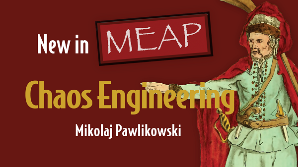

# Chaos Engineering: Crash test your applications

Source code accompanying [Chaos Engineering: Crash test your applications](https://www.manning.com/books/chaos-engineering?a_aid=chaos&a_bid=d3243216) book (now available in early access!)

## Contents

- [getting started with the VM](./getting-started.md)
- [build a custom VM image](./vm)
- [source code for examples divided by chapters](./examples)

## Free chapters!

First few chapters are available for free during the early access:

  - [Chapter 1: Into the world of chaos engineering](https://livebook.manning.com/book/chaos-engineering/chapter-1?origin=github.com)
  - [Chapter 2: First cup of Chaos & blast radius](https://livebook.manning.com/book/chaos-engineering/chapter-2?origin=github.com)
  - [Chapter 3: Observability](https://livebook.manning.com/book/chaos-engineering/chapter-3?origin=github.com)
  - [Chapter 4: Database trouble & testing in production](https://livebook.manning.com/book/chaos-engineering/chapter-4?origin=github.com)

## Contact

For erratas, please file an issue. For inquires about public speaking or writing, reach out to `mikolaj at pawlikowski dot pl`.

[twitter](https://twitter.com/mikopawlikowski) [linkedin](https://www.linkedin.com/in/mikolajpawlikowski/)
